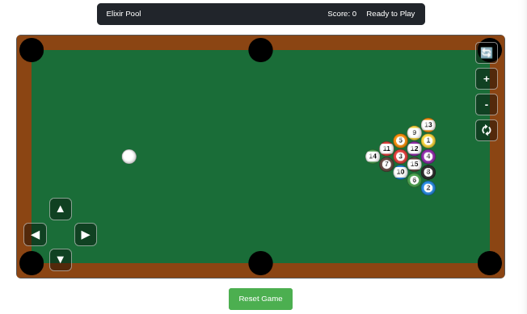

# SnookerGameEx

SnookerGameEx is a real-time multiplayer snooker game built with the Phoenix Framework and Elixir.




# Pre-requisite
Understant all off thins in my last project. You can make you own aproach for all things in this project. And add your optimization. And add your performance code. 
[Collision Simulator Ex](https://github.com/matheuscamarques/collision_simulator_ex)


## Project Overview

This document provides a high-level overview of the architecture and modules of the project.

### Core Concepts

- **OTP Supervision Tree**: The application adheres to OTP principles, with supervisors managing the lifecycle of all dynamic processes to ensure robustness and fault tolerance.

- **Fixed-Step Game Loop**: The `CollisionEngine` operates on a fixed-step loop, decoupled from rendering frame rate. This ensures that the simulation remains deterministic and consistent, regardless of client performance or network latency.

- **Stateful Processes**: Each ball on the snooker table is managed by an independent `GenServer` process (`Particle`), which holds and updates its own state (position, velocity, etc.).

- **Optimized Collision Detection**: To avoid the performance cost of O(n²) checks, the engine uses spatial partitioning (`Quadtree` or `SpatialHash`) for broad-phase collision detection.

- **Numerical Elixir (Nx)**: Heavy collision detection and response calculations are offloaded to `Nx`, enabling JIT-compilation and GPU acceleration for improved performance.

- **Real-time Updates**: `Phoenix.PubSub` broadcasts game state changes to the `LiveView`, which pushes updates to the browser in real-time.

## Module Breakdown

### Application and Supervision

- **`SnookerGameEx.Application`**: Entry point of the application, responsible for starting the web endpoint, `PubSub`, and game simulation supervisors.

- **`SnookerGameEx.ParticleSupervisor`**: A dynamic supervisor that manages the lifecycle of all ball (`Particle`) processes, including their creation and initialization.

### Game Simulation Core

- **`SnookerGameEx.CollisionEngine`**: The central simulation engine, implemented as a `GenServer`. It runs the main game loop, instructs particles to move, detects collisions, and computes collision responses.

- **`SnookerGameEx.Particle`**: Represents a single ball as a `GenServer`. It stores and updates its own state and communicates with the frontend after any state changes.

- **`SnookerGameEx.Physics`**: A stateless module using `Nx.Defn` for JIT-compiled CPU/GPU functions. It handles narrow-phase collision detection and collision resolution.

### Data Structures

- **`SnookerGameEx.Quadtree` / `SnookerGameEx.SpatialHash`**: Spatial partitioning structures used to optimize collision detection by filtering only nearby particles.

### Web Interface

- **`SnookerGameExWeb.SnookerGameLive`**: The main `LiveView` module responsible for rendering the game, handling user interactions, and subscribing to game updates via `PubSub`.

- **`assets/js/app.js`**: Client-side JavaScript with a `CanvasHook` that handles HTML5 canvas rendering of the game board, cue, and balls. It also listens for and applies updates from the backend.

## How to Run

To start your Phoenix server:

1. Install dependencies:

   ```bash
   mix setup
````

2. Start the Phoenix endpoint:

   ```bash
   mix phx.server
   ```

   Or with IEx:

   ```bash
   iex -S mix phx.server
   ```

3. Open your browser and visit:

   [http://localhost:4000](http://localhost:4000)

## Production Deployment

Ready to run in production? Check out the [Phoenix deployment guides](https://hexdocs.pm/phoenix/deployment.html).

## Learn More

* Official Website: [phoenixframework.org](https://www.phoenixframework.org/)
* Guides: [hexdocs.pm/phoenix/overview.html](https://hexdocs.pm/phoenix/overview.html)
* Documentation: [hexdocs.pm/phoenix](https://hexdocs.pm/phoenix)
* Forum: [Elixir Forum - Phoenix](https://elixirforum.com/c/phoenix-forum)
* Source Code: [Phoenix GitHub](https://github.com/phoenixframework/phoenix)

